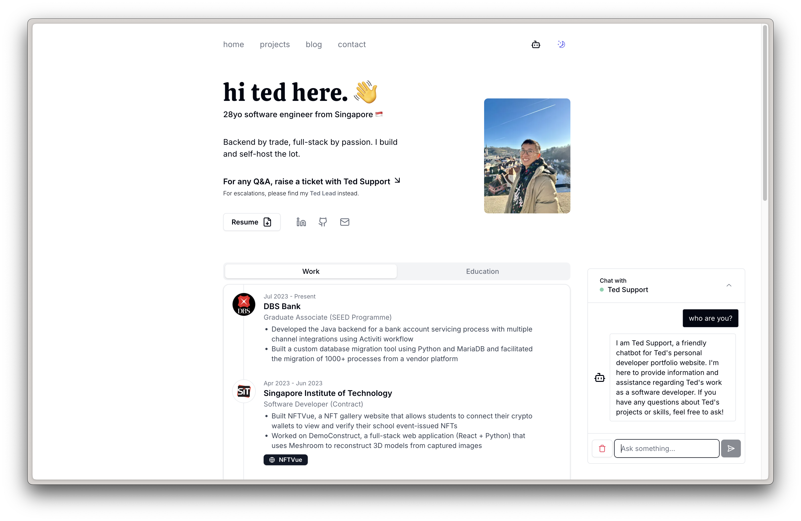

# My Personal Portfolio

A clean, minimal portfolio website built with Next.js, Tailwind CSS, and Shadcn UI. Features an AI chatbot, email contact form, and blog.

> The main branch is where I experiment with new ideas. If you want a stable, ready-to-use version, check out the [v1.0.0 release](https://github.com/tedawf/tedawf.com/releases/tag/v1.0.0).

## Live Demo

🌐 Check it out here: **[tedawf.com](https://tedawf.com)**



## Features

- Minimal design with Shadcn UI
- Light/dark mode toggle
- AI chatbot (Ted Support) trained on my portfolio content - please be nice to it! 😊
- Contact form with email integration
- Responsive mobile design
- Blog section

## Tech Stack

### v1.0.0

- Next.js
- Tailwind CSS
- Shadcn UI
- OpenAI API (chatbot)
- Vercel (hosting)
- AstraDB (vector storage)
- Upstash (caching)
- Resend (email)

### Main branch

- Next.js
- Tailwind CSS
- Shadcn UI
- OpenAI API (chatbot)
- Vercel (hosting)
- Resend (email)
- Postgres + pgvector (vector storage)
- Obsidian + LiveSync plugin (CMS)
- CouchDB (document storage)

## Getting Started

```bash
git clone https://github.com/tedawf/tedawf.com my-portfolio
cd my-portfolio
git checkout tags/v1.0.0
npm install
cp .env.example .env.local
# add your API keys to .env.local
npm run dev
```

## Environment Variables

```env
RESEND_API_KEY=your_key
OPENAI_API_KEY=your_key
ASTRA_DB_API_ENDPOINT=your_endpoint
ASTRA_DB_APPLICATION_TOKEN=your_token
ASTRA_DB_COLLECTION="embeddings"
UPSTASH_REDIS_REST_URL=your_url
UPSTASH_REDIS_REST_TOKEN=your_token
```

## Customization

- Update personal info in `src/data/*.json`
- Replace projects in `src/data/projects.json`
- Replace blog posts in `content/` or remove it.
- Replace your resume with `public/resume.pdf`
- Modify chatbot prompt in `src/app/api/chat/route.ts`

## Deployment

I prefer [Vercel](https://vercel.com/) for Next.js projects:

1. Push your fork to GitHub
2. Connect repo to Vercel
3. Add environment variables
4. Deploy 🎉

## Costs

- OpenAI API: ~$5
- Domain: ~$20/year
- Hosting/DB: Free tiers

## License

MIT

## Featured on YouTube!

📺 **[Live Portfolio Review by Anthony Sistilli](https://www.youtube.com/watch?v=aUJiNyb3cvM&t=40s)** - Got reviewed live on his stream!

🔥 **[Started a trend?](https://youtu.be/ib-Nlg9qWBw?si=1atsKJyfYDXtFVnE&t=400)** - Apparently this portfolio design inspired others!

---

✨ Feel free to fork and make it your own! Would love to see what you guys do with it!

-- Ted
